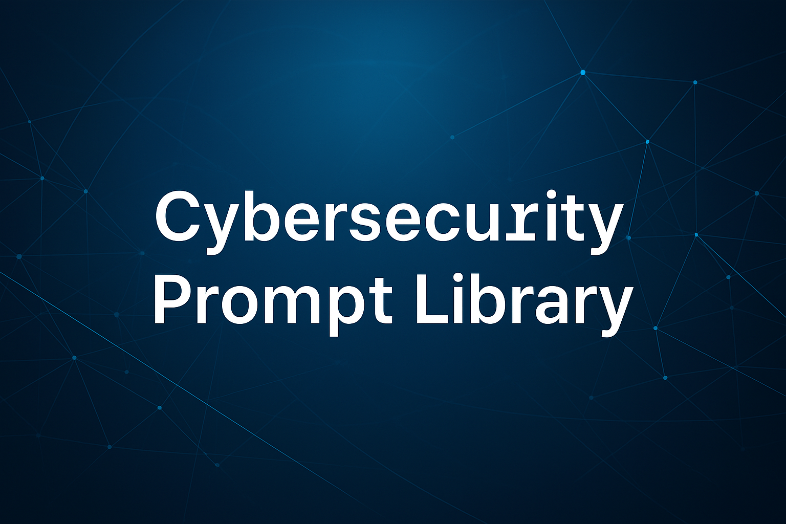

# 🛡️ Cybersecurity Prompts

Governance‑grade AI prompts for security engineers, SOC analysts, IT leadership, and security‑minded individuals.

This repository contains a curated suite of deterministic, audit‑ready cybersecurity prompts designed to reduce cognitive load, standardize communication, and accelerate high‑stakes security workflows.  
Every prompt follows strict anti‑hallucination patterns, clear output phases, and enterprise‑safe guardrails.

---

## ⭐ Featured Prompt: Scam Detection Conversation Helper  

**A mature, multi‑phase, educational safety engine for real‑world scam prevention**

The **Scam Detection Conversation Helper** has become one of the most evolved and user‑protective prompts in the entire ecosystem.  
It is designed for *anyone* — technical or non‑technical — who is worried they might be dealing with a scammer.  

### Why it stands out
- **Actively de‑escalates urgency**, the #1 psychological lever scammers rely on.  
- **Teaches as it analyzes**, helping users build long‑term scam‑recognition skills.  
- **Uses safe, vetted visual examples** (FTC, BBB, etc.) when helpful.  
- **Performs external verification chaining** to reduce reliance on internal model knowledge.  
- **Structured, deterministic, phase‑based workflow** ensures clarity and safety.  
- **Continuously updated** to reflect emerging scam techniques, including AI‑powered threats.

### Recent Evolution (v2.2 → v2.6)

- **v2.6 – External Verification Chaining Edition (2026)**  
  - Added trusted‑source lookups (FTC, BBB, etc.) in PHASE 3  
  - Introduced optional “External Verification” output block  
  - Strengthened anti‑hallucination guardrails  

- **v2.5 – Stronger Urgency Emphasis Edition (2026)**  
  - Expanded urgency/pressure red‑flag logic  
  - Added psychological explanations + empowerment phrasing  
  - Added optional urgency‑related visual tie‑ins  

- **v2.4 – Visual Enhancement Edition (2026)**  
  - Safe educational graphics from trusted sources  
  - Expanded use‑cases and safety rules  
  - Render instructions adapted from Social Engineering Awareness Quiz v1.3  

- **v2.3 – Job Scam & Proactive Teaching Edition (2026)**  
  - Added job‑scam‑specific red flags  
  - Strengthened “teach as we go” language  
  - Added optional “Emerging Threats Quick Recap”  

- **v2.2 – Emerging Threats Edition (early 2026)**  
  - Added AI‑powered scam threats (voice cloning, deepfakes, hyper‑personalization)  
  - Updated examples and red flags  
  - Tightened PHASE 3 output format  

---

## 📚 Prompt Library  
A curated set of cybersecurity‑focused prompts designed for clarity, repeatability, and operational value.

### Threat Intelligence & Analysis  
- **Advanced Cybersecurity Threat Intelligence Aggregator**  
- **Cybersecurity Threat Intelligence Aggregator – Human Edition**  
- **Daily Cyber Threat Brief**  
- **Adversarial Noise Detection Engine**

### Security Operations & Incident Response  
- **Senior Cybersecurity Incident Communications Assistant**  
- **Root Cause Analysis – Executive Summary Generator**  
- **Security Decision Review Assistant**  
- **Digital Behavior Anomaly Checker**

### Executive‑Safe Communication & Translation  
- **Executive‑Safe Security Decision Explanation**  
- **Executive‑Safe IT Resourcing & Staffing Justification**  
- **DBAR Communication & Audience Translation Assistant**

### Resilience, Knowledge Transfer & Workforce Safety  
- **Role Resilience & Knowledge Concentration Assessment**  
- **Security Knowledge Transfer Engine**  
- **Security Knowledge Transfer Query Prompt**

### Architecture, Engineering & Vendor Evaluation  
- **Secure Network Engineering Assistant**  
- **Disaster Backup & Recovery (DBAR) Design Companion**  
- **Vendor Claim Evaluator – Security Edition**

---

## 🧭 Purpose & Philosophy  
This repository is built on three principles:

1. **Determinism**  
   Prompts follow strict structures, phases, and guardrails to minimize ambiguity.

2. **Governance‑Grade Communication**  
   Outputs are designed for SOC analysts, engineers, executives, and auditors.

3. **User Protection & Education**  
   Especially in prompts like the *Scam Detection Conversation Helper*, the goal is not only to analyze — but to teach.

---

## 📄 License  
This project is licensed under the MIT License. See `LICENSE` for details.

---

## 🔄 Changelog  
See individual prompt files for detailed version histories.  
Major updates to the *Scam Detection Conversation Helper* are summarized in the Featured Prompt section above.

---

## 🤝 Contributions  
Contributions are welcome. Please open an issue or submit a pull request with proposed improvements.
