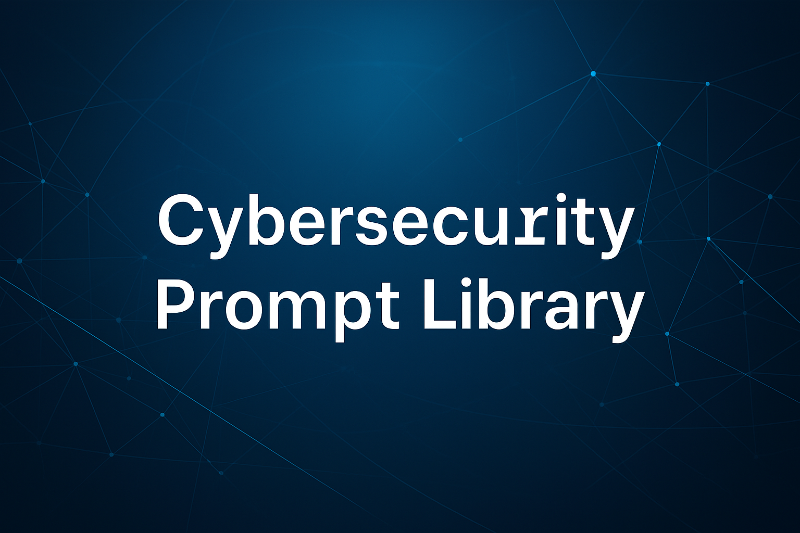

# 🛡️ Cybersecurity Prompts  

**Deterministic. Audit-ready. Enterprise-grade.**

A curated collection of AI prompts engineered for security engineers, SOC analysts, incident responders, threat hunters, security leadership, and anyone serious about using AI responsibly in high-stakes security environments.

These prompts are built from real-world operational experience to:  
- Enforce strict anti-hallucination and verification chaining  
- Produce consistent, defensible, professionally phrased outputs  
- Accelerate workflows while maintaining governance, compliance, and executive trust  
- Educate and protect users (especially in social engineering and scam scenarios)

Maintained by a practicing cybersecurity professional dedicated to raising the bar on AI-assisted security operations and openly sharing battle-tested tools with the community.

  
  
  

## Table of Contents
- [Why These Prompts?](#why-these-prompts)
- [Key Design Principles](#key-design-principles)
- [Featured Prompts](#featured-prompts)
- [Prompt Categories](#prompt-categories)
- [How to Use](#how-to-use)
- [Security & Responsible Use](#security--responsible-use)
- [Changelog](#changelog)
- [Contributing](#contributing)
- [License](#license)

## Why These Prompts?

In security operations, vague or hallucinated AI outputs can lead to misinformed decisions, compliance gaps, or worse. These prompts are deliberately strict: phased workflows, explicit guardrails, output templates, and external verification steps ensure reliable, evidence-based results you can trust in tickets, reports, briefings, or executive summaries.

Created and refined through hands-on work in threat detection, incident response, security architecture, and program leadership. Open-sourced to help elevate the entire cybersecurity community's responsible adoption of AI tools.

## Key Design Principles
1. **Determinism** — Strict structures, numbered phases, and mandatory output formats reduce variability.  
2. **Governance-Grade** — Outputs are auditor-friendly, executive-safe, and defensible.  
3. **User Protection & Education** — Especially in user-facing prompts, the focus is on de-escalation, teaching red flags, and building long-term resilience.
4. **Anti-drift** — September 2026 hardening added garbage/jailbreak rejection, locked templates, and state-decay locks across the library.

## Featured Prompts

### Scam Detection Conversation Helper

**A mature, multi-phase, educational safety engine for real-world scam prevention** — suitable for technical and non-technical users alike.

- Counters urgency/pressure tactics  
- Teaches scam recognition while analyzing  
- Chains external verification (FTC, BBB, IC3)  
- 2026 coverage: AI voice cloning, deepfakes, job scams, already-acted recovery branch  

Companion: [Scam Detector – Technical Edition.md](Scam%20Detector%20%E2%80%93%20Technical%20Edition.md)

Full prompt: [Scam Detection Conversation Helper.md](Scam%20Detection%20Conversation%20Helper.md)

### Daily Cyber Threat Brief (v1.8.4)

Consumer-mode daily brief with locked markdown output, evidence rules, and social-share-ready phrasing. v1.8.4 adds state-decay / jailbreak defenses and fallback behavior for garbage input or generation drift.

Full prompt: [Daily Cyber Threat Brief.md](Daily%20Cyber%20Threat%20Brief.md)

## Prompt Categories

| Category | Focus Areas | Key Prompts |
|---------------------------------------|--------------------------------------------------|-------------|
| **Threat Intelligence & Analysis** | Aggregation, daily briefs, anomaly & adversarial detection | [Advanced Cybersecurity Threat Intelligence Aggregator](Advanced%20Cybersecurity%20Threat%20Intelligence%20Aggregator.md) [Cybersecurity Threat Intelligence Aggregator - Human Readable output](Cybersecurity%20Threat%20Intelligence%20Aggregator%20-%20Human%20Readable%20output.md) [Daily Cyber Threat Brief](Daily%20Cyber%20Threat%20Brief.md) [Adversarial Noise Detection Engine](Adversarial%20Noise%20Detection%20Engine.md) |
| **Consumer Threat Visuals** | Social-ready briefs and image prompts from approved sources | [Cyber Threat Brief Infographic Engine](Cyber%20Threat%20Brief%20Infographic%20Engine.md) [Cyber Threat Infographic Generator](Cyber%20Threat%20Infographic%20Generator.md) [Infographic Content Formatter](Infographic%20Content%20Formatter.md) |
| **Security Operations & IR** | Incident comms, root cause, decision review, playbooks | [Senior Cybersecurity Incident Communications Assistant](Senior%20Cybersecurity%20Incident%20Communications%20Assistant.md) [Executive Summary Generator for Root Cause Analysis](Executive%20Summary%20Generator%20for%20Root%20Cause%20Analysis.md) [Digital Behavior Anomaly Checker](Digital%20Behavior%20Anomaly%20Checker.md) [Root cause analysis](Root%20cause%20analysis.md) [Security Decision Review Assistant](Security%20Decision%20Review%20Assistant.md) [Incident Playbook Organizer and Updater](Incident%20Playbook%20Organizer%20and%20Updater.md) [Cybersecurity Playbook Architect](Cybersecurity%20Playbook%20Architect.md) |
| **Executive & Governance Comms** | Translating tech to leadership, resourcing justification | [Executive-Safe Security Decision Explanation](Executive-Safe%20Security%20Decision%20Explanation.md) [Executive-Safe IT Resourcing & Staffing Justification](Executive-Safe%20IT%20Resourcing%20%26%20Staffing%20Justification.md) [DBAR Communication & Audience Translation Assistant](DBAR%20Communication%20%26%20Audience%20Translation%20Assistant.md) |
| **Resilience & Knowledge Transfer** | Role risk, handover, ownership transfer | [Role Resilience & Knowledge Concentration Assessment](Role%20Resilience%20%26%20Knowledge%20Concentration%20Assessment.md) [Security Knowledge Transfer Engine](Security%20Knowledge%20Transfer%20Engine.md) [Security Knowledge Transfer Query Prompt](Security%20Knowledge%20Transfer%20Query%20Prompt.md) [The Ownership Transfer Framework](The%20Ownership%20Transfer%20Framework.md) |
| **Architecture, Workflow & Vendor Eval** | Secure design, backup/recovery, claim validation, process design | [Secure Network Engineering Assistant](Secure%20Network%20Engineering%20Assistant.md) [Disaster Backup & Recovery (DBAR) Design Companion](Disaster%20Backup%20%26%20Recovery%20(DBAR)%20Design%20Companion.md) [Vendor Claim Evaluator – Security Edition](Vendor%20Claim%20Evaluator%20%E2%80%93%20Security%20Edition.md) [Workflow Architect – Interactive Workflow Design Assistant](Workflow%20Architect%20%E2%80%93%20Interactive%20Workflow%20Design%20Assistant.md) [Workflow Architect – Usage guide](Workflow%20Architect%20%E2%80%93%20Usage%20guide.md) |
| **AI & Prompt Security** | Hallucination checks, agentic/AI-specific vuln detection | [Hallucination Vulnerability Prompt Checker](Hallucination%20Vulnerability%20Prompt%20Checker.md) [Agentic AI Security Vulnerabilities Prompt Checker](Agentic%20AI%20Security%20Vulnerabilities%20Prompt%20Checker.md) |
| **Scam Prevention** | Consumer and technical scam triage | [Scam Detection Conversation Helper](Scam%20Detection%20Conversation%20Helper.md) [Scam Detector – Technical Edition](Scam%20Detector%20%E2%80%93%20Technical%20Edition.md) |

## How to Use
1. Copy the prompt text from the .md file.  
2. Paste into your preferred LLM interface (ChatGPT, Claude, Grok, etc.).  
3. Provide context/facts only as instructed — never include real PII, credentials, or sensitive data.  
4. Review outputs critically; these are tools, not oracles.

## Security & Responsible Use
- **Never input sensitive data** (credentials, PII, internal logs, etc.) into public LLMs.  
- Always cross-verify critical outputs against trusted sources.  
- Use these prompts in controlled environments; treat AI as an accelerator, not a replacement for expertise.  
- If you identify a prompt weakness or safety improvement, report it via a private issue or discussion.

## Changelog

### September 2026
- Daily Cyber Threat Brief → **v1.8.4** (locked template, jailbreak/state-decay defenses).
- Threat intel aggregators: YAML-only / API-mode guidance and failed-source handling.
- Added Cyber Threat Brief Infographic Engine and Infographic Generator (approved-source, recency rules).
- Vendor Claim Evaluator → **v1.5.1**; Workflow Architect → **v1.1.1** + usage guide.
- Added The Ownership Transfer Framework and Scam Detector – Technical Edition.
- Library-wide garbage-input, jailbreak, and format-fallback guardrails.

## Contributing
Contributions are very welcome — especially:  
- New prompts validated in real workflows  
- Enhancements to determinism, anti-hallucination, or executive phrasing  
- Updates for emerging threats (quantum risks, AI agent attacks, etc.)

Please:  
- Open an issue first for major additions  
- Follow existing style: clear phases, explicit instructions, structured outputs  
- Include version notes in the prompt file

## Cross-Repo Navigation
- 💼 Job Search & Career Prompts → https://github.com/scottmalin68-commits/Job-Search-Career-Prompts  
- 🎮 Cybersecurity Learning Prompts → https://github.com/scottmalin68-commits/Cybersecurity-Learning-Prompts  
- 🧩 Misc AI Prompts → https://github.com/scottmalin68-commits/Misc-AI-Prompts  
- 🧰 PowerShell Scripts → https://github.com/scottmalin68-commits/Powershell_Scripts  

## License
MIT License — see [LICENSE](LICENSE) for full details.

Maintained by Scott Malin, Senior Cybersecurity Engineer (CISSP) — Scott.Malin68@gmail.com
